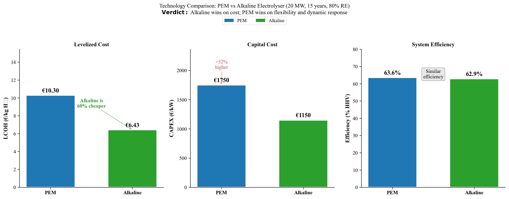
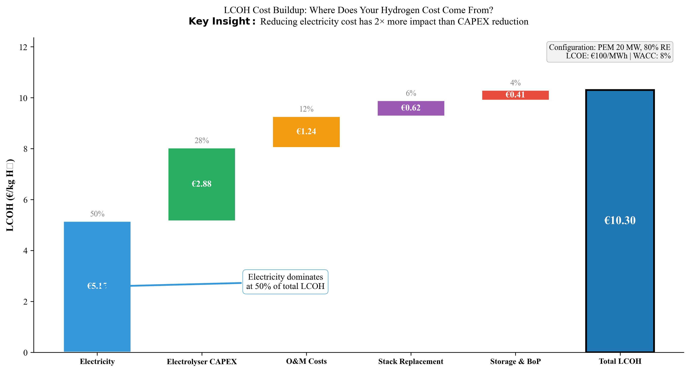
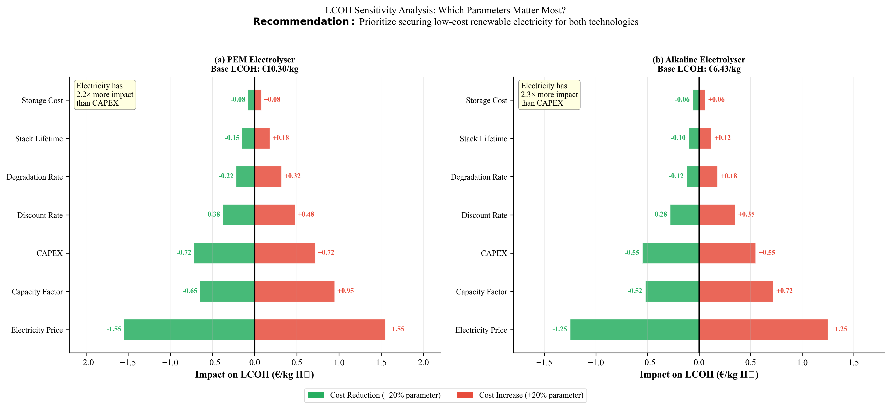
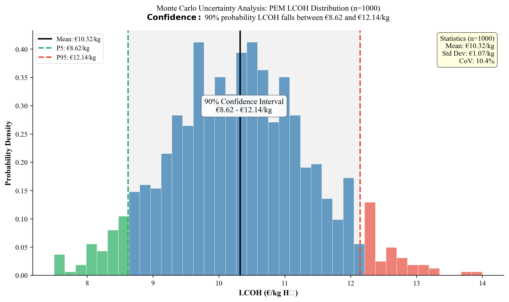

# Hydrogen Electrolyser Techno-Economic Optimisation

> **Python simulation framework for 15-year techno-economic comparison of PEM and Alkaline water electrolysers under real-world renewable energy conditions.**


*Master Thesis — Shubham Manchanda | Hydrogen Technology & Economics, TH Ingolstadt | Conducted at Fraunhofer IFF, Magdeburg*

---

## Why This Matters

Green hydrogen is central to Europe's energy transition, but the **investment decision between PEM and Alkaline electrolysers** remains unclear under variable renewable supply. This model quantifies that decision with real engineering data — making it directly useful for energy companies evaluating electrolyser projects.

---

## Key Results

| Metric | PEM (35 MW, 12 t storage) | Alkaline (20 MW, 10 t storage) |
|--------|---------------------------|-------------------------------|
| **LCOH** | **€9.06 /kg H₂** | **€4.86 /kg H₂** |
| **Demand Satisfaction** | 95.4% | 96.0% |
| **Capacity Factor** | 41.1% | 73.0% |
| **15-Year NPV** | −€62.5M | +€18.2M |
| **Stack Replacements** | 1 (at ~60,000 h) | 1 (at ~80,000 h) |
| **Monte Carlo LCOH Range** | €6.24 – €12.64 /kg | €4.35 – €7.04 /kg |

> **Bottom line:** Alkaline achieves **46% lower hydrogen cost** than PEM under identical renewable conditions, primarily due to lower capital cost and longer stack lifetime.

### Key Insights

1. **Electricity cost dominates LCOH** — renewable generation cost (LCOE) accounts for 50–65% of total hydrogen cost for both technologies, making it the single most important lever for project economics
2. **Alkaline wins on cost, PEM wins on flexibility** — Alkaline's lower CAPEX (€1,150 vs €1,950/kW) and longer stack lifetime (80,000 vs 60,000 h) drive its cost advantage, but PEM handles variable renewable input with wider load range (5–100% vs 20–100%)
3. **Degradation increases LCOH by 8–12% over 15 years** — voltage degradation (1.5 µV/h PEM, 0.7 µV/h Alkaline) progressively reduces efficiency, requiring stack replacement that adds €0.30–0.80/kg to lifetime cost
4. **System sizing is non-trivial** — undersized electrolysers waste renewable energy through curtailment; oversized systems increase CAPEX without proportional output gains. The optimum is configuration-specific, not rule-of-thumb
5. **Uncertainty is significant** — Monte Carlo analysis shows LCOH can vary by ±40% (PEM) and ±30% (Alkaline) depending on input assumptions, highlighting the risk of deterministic-only analysis

### Sample Output

<p align="center">
  
</p>
<p align="center"><em>Figure 1 — Side-by-side comparison of PEM and Alkaline electrolyser performance across key metrics</em></p>

<p align="center">
  
</p>
<p align="center"><em>Figure 2 — LCOH waterfall breakdown showing electricity cost as the dominant driver</em></p>

<p align="center">
  
</p>
<p align="center"><em>Figure 3 — Tornado sensitivity analysis: electricity price dominates LCOH uncertainty for both technologies</em></p>

<p align="center">
  
</p>
<p align="center"><em>Figure 4 — Monte Carlo simulation (N=10,000) showing LCOH probability distributions</em></p>

---

## Features

- **Hourly simulation** — 131,400 timesteps over 15 years with real wind+solar profiles (132 MW installed capacity)
- **Electrochemical modelling** — Nernst-based reversible voltage, Butler-Volmer activation, ohmic and concentration overpotentials
- **Degradation model** — Voltage degradation (µV/h) with stack replacement logic based on efficiency thresholds
- **Grid-search optimisation** — 600 configurations (10 electrolyser sizes × 10 storage capacities × 6 renewable fractions)
- **Economic analysis** — LCOH, NPV, IRR, payback period, CAPEX/OPEX breakdown with oxygen revenue credits
- **Uncertainty quantification** — Monte Carlo simulation (N=10,000) + tornado sensitivity charts
- **Publication-ready plots** — 90+ figures generated automatically in PNG and PDF

---

## How It Works

```
Input Data                    Simulation Engine                 Economic Output
──────────                    ─────────────────                 ───────────────
Wind + Solar power    →   Electrolyser model          →   LCOH (€/kg H₂)
(8,760 h/year × 15yr)       • Polarisation curve             NPV, IRR
                             • Degradation tracking            Payback period
H₂ demand profile    →      • Stack replacements        →   Cost breakdown
(hourly kg)                  • Storage buffer dynamics         (CAPEX, OPEX, energy)

                       Optimisation: grid search over 600 configurations
                       Selection: lowest LCOH meeting ≥95% demand satisfaction
```

**Cell voltage model:**  
`V = E_rev(T, P) + η_activation + η_ohmic + η_concentration`

---

## Quick Start

```bash
# Clone and set up
git clone https://github.com/shubham0429/Hydrogen-Electrolyser-Optimisation.git
cd Hydrogen-Electrolyser-Optimisation
python3 -m venv .venv && source .venv/bin/activate
pip install -r requirements.txt

# Run PEM 15-year simulation (~6 min)
cd source_code
python run_pem_thesis_final.py

# Run Alkaline 15-year simulation (~4 min)
python run_alkaline_thesis_final.py
```

Results appear in `results/pem_thesis_final/` and `results/alkaline_thesis_final/`.

### All Scripts

| Script | Purpose | Runtime |
|--------|---------|---------|
| `run_pem_thesis_final.py` | PEM 15-year simulation + 8 figures | ~6 min |
| `run_alkaline_thesis_final.py` | Alkaline 15-year simulation + 8 figures | ~4 min |
| `corrected_thesis_plots.py` | Comparison plots + optimisation heatmaps | ~30 sec |
| `sensitivity_analysis_alkaline.py` | Monte Carlo (N=10,000) + tornado charts | ~50 sec |
| `pem_optimization_v3.py` | PEM grid search (600 configs × 6 RE)¹ | ~3–5 hrs |
| `alkaline_optimization_v3.py` | Alkaline grid search¹ | ~3–5 hrs |

> ¹ Pre-computed results are included in `results/data/`. Only re-run if changing parameters.

---

## Project Structure

```
├── README.md
├── ABSTRACT.txt                        Thesis abstract (200 words)
├── requirements.txt                    numpy, scipy, pandas, matplotlib
│
├── data/
│   ├── combined_wind_pv_DATA.mat       Hourly wind+solar power (8,760 h)
│   └── Company_2_hourly_gas_demand.csv Hourly hydrogen demand profile
│
├── source_code/
│   ├── sim_concise.py                  PEM electrolyser model (core engine)
│   ├── sim_alkaline.py                 Alkaline electrolyser model (core engine)
│   ├── electrochemistry.py             Electrochemical equations
│   ├── data_loader.py                  MATLAB .mat file loading
│   ├── run_pem_thesis_final.py         → Run this for PEM results
│   ├── run_alkaline_thesis_final.py    → Run this for Alkaline results
│   ├── pem_optimization_v3.py          Grid search optimisation (PEM)
│   ├── alkaline_optimization_v3.py     Grid search optimisation (Alkaline)
│   ├── corrected_thesis_plots.py       → Comparison figures (recommended)
│   ├── sensitivity_analysis_alkaline.py Monte Carlo + sensitivity
│   └── ...                             Additional plotting scripts
│
└── results/
    ├── pem_thesis_final/               PEM: 131,400-row timeseries + 8 figures
    ├── alkaline_thesis_final/          Alkaline: same structure
    ├── thesis_final_plots/             Best figures for publication
    ├── plots/                          All 90+ thesis figures
    └── data/                           Pre-computed optimisation CSVs
        ├── pem_grid_search_all_RE.csv       416 PEM configurations
        ├── alkaline_grid_search_all_RE.csv  600 Alkaline configurations
        ├── monte_carlo_results.csv
        └── sensitivity_results.csv
```

---

## Technical Details

| | |
|---|---|
| **Language** | Python 3.9+ |
| **Dependencies** | numpy, scipy, pandas, matplotlib |
| **Input data** | 132 MW wind+solar (MATLAB .mat), hourly H₂ demand (CSV) |
| **Simulation horizon** | 15 years (131,400 hours) |
| **Optimisation** | Exhaustive grid search, 3-criteria hierarchical selection |
| **Uncertainty** | Monte Carlo N=10,000, seeded (seed=42) for reproducibility |
| **Tested on** | macOS (Python 3.9.6), compatible with Linux/Windows |

---

## Troubleshooting

| Problem | Solution |
|---------|----------|
| `ModuleNotFoundError` | Run `pip install -r requirements.txt` inside activated venv |
| `FileNotFoundError: .mat file` | Run scripts from `source_code/`, not the root folder |
| `python: command not found` | Use `python3` instead |
| Optimisation takes hours | Normal. Use pre-computed CSVs in `results/data/` |

---

## Contact

**Shubham Manchanda**  
Hydrogen Technology & Economics (core modules completed), TH Ingolstadt  
Thesis conducted at [Fraunhofer IFF](https://www.iff.fraunhofer.de), Magdeburg

## License

This project is licensed under the [MIT License](https://opensource.org/licenses/MIT).  
Feel free to use, adapt, or build on this work with attribution.
